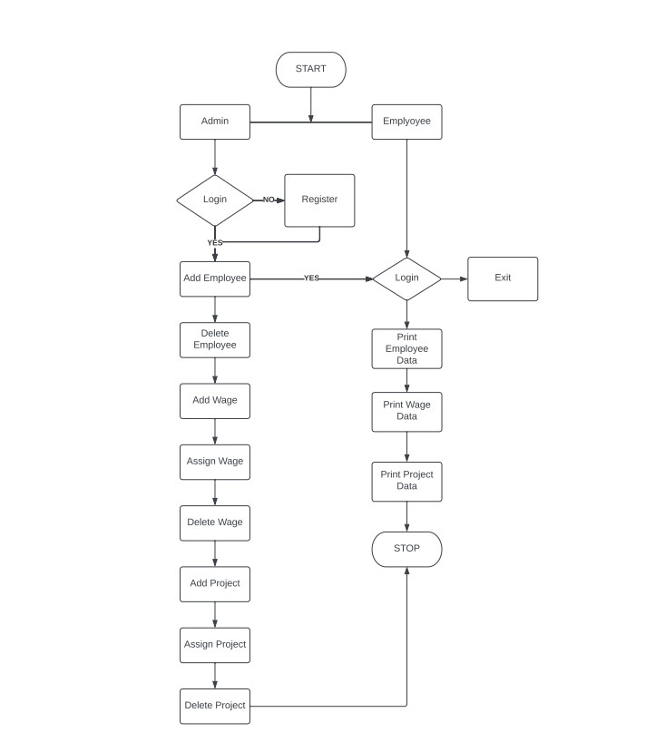

<h1 align="center">Human Resource Management System</h1> 
 

    
    
    
    

<h3 align="center"><a href="[https://wonderful-malasada-e63214.netlify.app/]([https://luminous-cocada-0f0885.netlify.app/]([https://luminous-cocada-0f0885.netlify.app/](https://luminous-cocada-0f0885.netlify.app/)))"><strong>Want to see live preview »</strong></a></h3>

 
     &#10023;
    <a href="#Getting-Started">Getting Started</a> &#10023; <a href="#Setup">Setup</a> &#10023;    
    <a href="#Contributors">Contributors</a> &#10023;
  

  A human resources management system (HRMS) is a form of Human Resources (HR) software that combines a number of systems and processes to ensure the easy management of human resources, business processes and data. Human resources software is used by businesses to combine a number of necessary HR functions, such as storing employee data, managing payroll, recruitment, benefits administration (total rewards), time and attendance, employee performance management, and tracking competency and training records.
 

## 🚀 Features
- Admin Registration.
- Admin Login.
- Employees can be added.
- Salary can be assigned.
- Project can be assigned.
- Employee data can be accessed.

## 🧠 Admin

-   Admin Registration. 

-   Admin Login. 

-   Admin can add employees. 

-   Admin can delete employees. 

-   Wage can be added. 

-   Wage can be delted. 

-   Wage can be assigned. 

-   Project can be added. 

## 🧑‍💼 Employee

-   Employee Login. 

-   Employee list can be viewed.

-   Wage lsit can be viewed.

-   Project list can be viewed.

 

## Getting Started

This project was built using Basic Java and Mysql.

### Setup

The project repository can be found in [GitHub link](https://github.com/deepak2303/swell-crime-5054) or just clone the project using this command. 

## Open with live server 
Open the vs-code editor right click on index.js and select open with live server 

## Open using Copy path 
Open the vs-code editor right click on index.js and select the copy path then paste it into your browser

### Tools used on this project

- Spring Boot

 

## Show your support

Give a ⭐ if you like this project!
